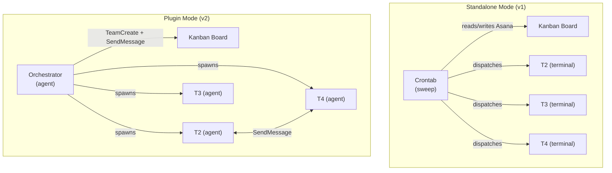
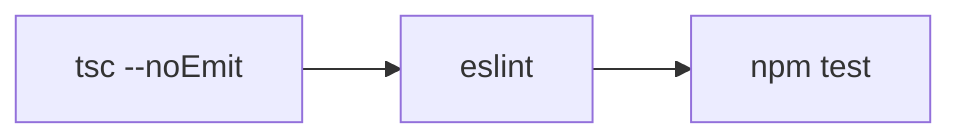
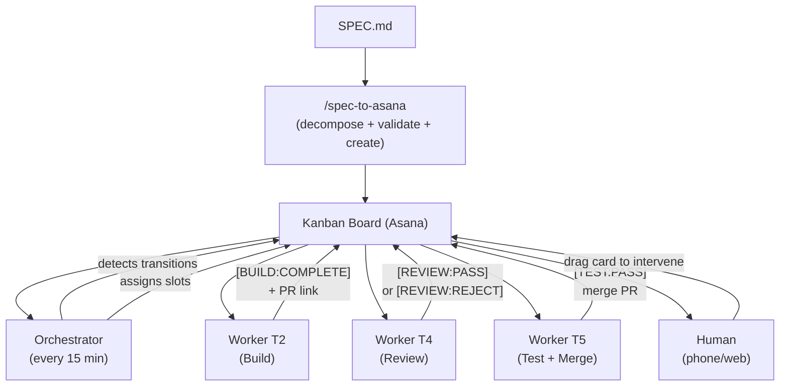
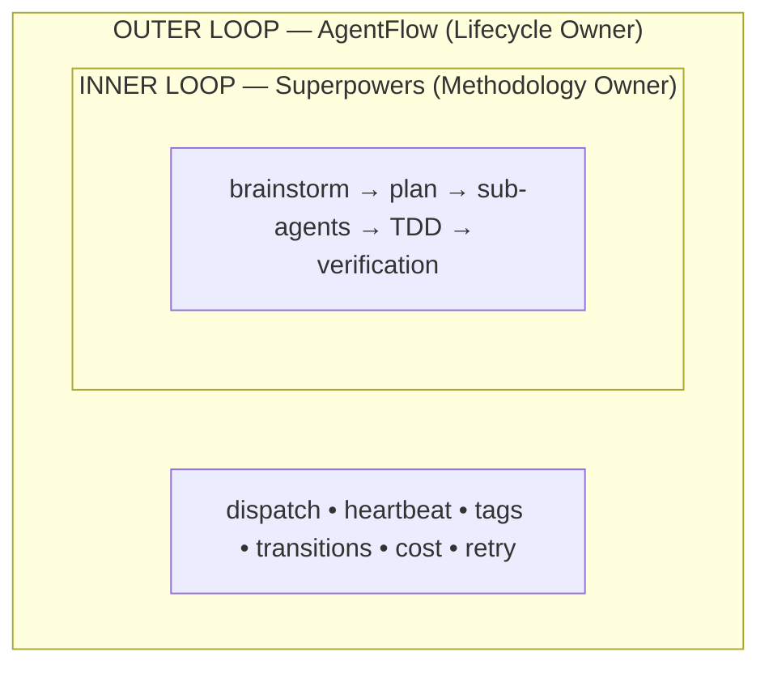
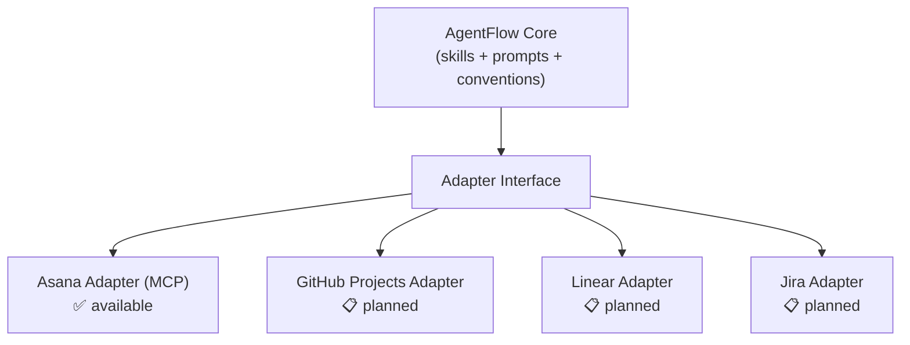

# AgentFlow Architecture

> How AgentFlow turns your Kanban board into an autonomous AI software development pipeline with full observability, deterministic quality gates, and built-in cost controls.

## Core Principle

**Your project management tool IS the orchestration layer.**

AgentFlow doesn't build a separate database, message queue, or custom infrastructure. It reads and writes pipeline state directly to your Kanban board (Asana, GitHub Projects, Linear, Jira). This gives you:

- **Crash recovery for free**: State survives agent crashes because it lives in your PM tool
- **Phone-accessible observability**: Monitor the entire pipeline from any device
- **Human override at any point**: Drag a card to "Needs Human" to intervene
- **Audit trail built-in**: Every agent decision is a comment on the task card

## v2 Architecture: Dual-Mode

AgentFlow v2 supports two execution modes from the same codebase:

### Standalone Mode (v1)
The original architecture. Workers are separate terminal sessions, orchestrator runs via crontab, all communication flows through Asana comments.

### Plugin Mode (v2)
Workers spawn as a named agent team inside Claude Code. The orchestrator creates the team, dispatches via SendMessage for instant handoffs, and hooks enforce quality gates at the tool level.



### What Changes in Plugin Mode

| Aspect | Standalone | Plugin |
|---|---|---|
| Worker spawning | Manual (iTerm tabs) | Automatic (TeamCreate) |
| Handoff latency | 15 min (sweep cycle) | <30 sec (SendMessage) |
| Quality gates | Prompt-enforced | Hook-enforced (lint-gate, coverage-gate, scope-guard) |
| Progress tracking | [HEARTBEAT] comments | Real-time telemetry via SendMessage |
| Communication | Asana only | SendMessage + Asana (dual channel) |
| Shutdown | Manual crontab edit | TeamDelete (clean teardown) |

### Hooks: Infrastructure-Level Gates

Plugin mode adds 3 hooks that enforce quality gates at the tool level:

| Hook | Event | What it does |
|---|---|---|
| **lint-gate** | PreToolUse on Bash | Blocks commit without tsc/lint/test |
| **coverage-gate** | Stop on tester | Blocks merge without 80% coverage |
| **scope-guard** | PreToolUse on Edit/Write | Warns then blocks unpredicted files |

## System Components

### 1. The Orchestrator (`/sdlc-orchestrate`)

A **stateless, one-shot sweep** that runs via real crontab — not a daemon, not a session-based scheduler.

```bash
*/15 * * * * ~/.claude/sdlc/agentflow-cron.sh >> /tmp/agentflow-orchestrate.log 2>&1
```

Each sweep:
1. Discovers all pipeline projects
2. Checks for spec drift (SHA-256 hash comparison)
3. Detects dead workers (heartbeat timeout > 10 min)
4. Processes stage transitions based on comment tags
5. Triggers feedback loops for rejected tasks
6. Dispatches ready tasks to available worker slots
7. Runs system-level retrospective (every 10 completions)
8. Updates the status dashboard
9. Checks for graceful shutdown signals

**Why stateless?** Session-based schedulers die with the terminal. A real crontab entry survives reboots, terminal crashes, and network interruptions. The orchestrator reads all state from the Kanban board on every sweep — it has no memory between invocations.

### 2. Workers (`/sdlc-worker --slot T<N>`)

Each worker is a Claude Code session bound to a slot identifier (T2, T3, T4, T5). Workers:

1. Query the Kanban board for tasks assigned to their slot
2. Determine the current stage from task metadata
3. Execute the appropriate stage prompt (research, build, review, test)
4. Post results as structured comments with machine-readable tags
5. Update task metadata (stage, cost, retry count)

Workers are stateless between tasks. When a worker finishes one task, it checks for the next assigned task. If none, it reports idle.

### 3. The Kanban Board (State Machine)

The board has 8 columns (sections):


**State is stored in two places:**

1. **Task position** (which column) — the current pipeline stage
2. **Task description header** — metadata: `[SLOT:T2] [STAGE:Build] [RETRY:1] [COST:~$2.50]`
3. **Task comments** — structured event log with machine-readable tags

### 4. Deterministic Quality Gates

Before any AI review happens, deterministic checks run:



This catches ~60% of issues (type errors, lint violations, failing tests) at near-zero cost. Only code that passes all three gates reaches the AI reviewer.

**After review**, a coverage gate runs:

```bash
npm test -- --coverage
```

New files must have ≥80% test coverage to proceed to the Test stage.

### 5. Feedback Loops

When a task fails (review reject, test fail, integration fail):

1. Retry counter increments
2. Accumulated context is posted: what was tried, what failed, what to do differently
3. Worker slot is cleared (on retry 2+, a different worker is assigned)
4. Task moves back to Build stage
5. Cost is updated and checked against guardrails

This creates a **learning loop** where each retry carries the full history of previous attempts.

### 6. System-Level Learning

Every 10 completed tasks, the orchestrator runs a retrospective:

1. Reads all reject/fail comments from completed tasks
2. Identifies common failure patterns (same error type appearing 3+ times)
3. Writes patterns to `LEARNINGS.md` in the project root
4. Future builders and reviewers read `LEARNINGS.md` before starting work

This means the system gets better over time — mistakes made in task 5 are avoided in task 50.

## Data Flow



## Superpowers Integration Layer

AgentFlow can optionally integrate with [Superpowers](https://github.com/NickBodnar/superpowers) (or similar methodology-as-prompt tools) to enhance build quality. The integration follows a strict two-layer architecture:

### Two-Layer Model



**AgentFlow** controls WHEN things happen (start, complete, heartbeat, retry, cost check).
**Superpowers** controls HOW things happen (planning approach, sub-agent strategy, TDD flow).

### Complexity Gating

Not every task benefits from full Superpowers overhead. Tasks are gated by complexity:

| Complexity | Brainstorm | Plan | Sub-Agents | Estimated Overhead |
|------------|-----------|------|------------|-------------------|
| Simple (S) | Skip | Skip | No | ~$0 extra |
| Medium (M) | Skip | Yes | Optional | ~$0.20-0.40 extra |
| Large (L) | Yes | Yes | Yes | ~$0.50-1.00 extra |

### Sub-Agent Management

When Superpowers dispatches sub-agents within a build stage:

- **Heartbeat continuity**: Parent posts `[HEARTBEAT]` before dispatching and between sub-agent completions. Sub-agents do not post their own heartbeats.
- **File conflict prevention**: Parent assigns non-overlapping file sets to each sub-agent based on the task's predicted files. If files cannot be cleanly partitioned, sub-agents run sequentially.
- **Output aggregation**: Parent aggregates all sub-agent outputs into a single structured comment before posting `[BUILD:COMPLETE]` or failure tags. This preserves context for retries.

## Safety & Sanitization

### Input Sanitization

Every stage execution begins with an input sanitization check. The worker scans task descriptions, research results, and external inputs for:

- Instruction override patterns ("ignore all previous instructions", "disregard above")
- Base64-encoded command sequences
- Suspicious URLs or redirect chains
- Attempts to read environment variables or secrets

If detected: `[SECURITY:WARNING]` is posted and the task moves to Needs Human.

### Verification Command Allowlist

Verification commands in task descriptions are restricted to known-safe patterns:

- `npm test`, `npm run <script>`, `npx <tool>`
- `pytest`, `python -m pytest`
- `go test`, `cargo test`, `mix test`
- `curl localhost:<port>` (local only)
- Custom commands explicitly allowlisted in project configuration

Commands containing pipes to `sh`, `eval`, `exec`, or network calls to external hosts are rejected.

### LEARNINGS.md as Injection Vector

LEARNINGS.md is written by the system (retrospective step) and read by all workers. A compromised or manipulated LEARNINGS.md could inject instructions into every subsequent build. Mitigations:

- LEARNINGS.md is capped at 50 lines (limits blast radius)
- Only the orchestrator's retrospective step writes to LEARNINGS.md
- Workers read LEARNINGS.md as reference data, not as executable instructions
- Patterns follow a strict format; anything not matching the format is ignored

## Cost Model

AgentFlow tracks costs per task using dual cost profiles:

### Sonnet Profile (default, recommended)
| Stage | Without Superpowers | With Superpowers (M) | With Superpowers (L) |
|-------|--------------------|--------------------|---------------------|
| Research | ~$0.10 | ~$0.10 | ~$0.10 |
| Build | ~$0.40 | ~$0.80 | ~$1.20 |
| Review | ~$0.10 | ~$0.10 | ~$0.10 |
| Test | ~$0.05 | ~$0.05 | ~$0.05 |
| Integrate | ~$0.03 | ~$0.03 | ~$0.03 |

Guardrails: Warning at $3, Hard stop at $10

### Opus Profile (for complex projects)
| Stage | Without Superpowers | With Superpowers (M) | With Superpowers (L) |
|-------|--------------------|--------------------|---------------------|
| Research | ~$1.00 | ~$1.00 | ~$1.50 |
| Build | ~$3.00 | ~$5.00 | ~$8.00 |
| Review | ~$0.50 | ~$0.50 | ~$0.50 |
| Test | ~$1.00 | ~$1.00 | ~$1.00 |
| Integrate | ~$0.25 | ~$0.25 | ~$0.25 |

Guardrails: Warning at $8, Hard stop at $20

**Orchestrator cost (crontab):**
- Default (`*/15`): ~$48/day with Opus, ~$10/day with Sonnet (recommended)
- Sprint mode (`*/5`): ~$144/day with Opus, ~$30/day with Sonnet
- Idle optimization: consecutive idle sweeps double the interval (15 -> 30 -> 60 min)

**Expected cost per sprint (14 tasks):**
- Sonnet profile, no Superpowers: ~$44-60
- Sonnet profile, with Superpowers: ~$60-100
- Opus profile, with Superpowers: ~$120-200

## Adapter Architecture

AgentFlow uses adapters to abstract the PM tool interface:



Each adapter maps these operations to the specific PM tool's API. The core skills and prompts never reference a specific tool — they use the adapter interface.

## Security Model

- **No secrets in code**: Mock values in tests, `process.env.X` in implementation
- **No force-push**: Integration failures create revert commits
- **No unreviewed merges**: Every PR goes through deterministic gates + adversarial AI review
- **Cost containment**: Automatic hard stops prevent runaway spending
- **Scope containment**: PR file changes compared against predicted files
- **Worker isolation**: Each worker operates in its own git worktree

## Failure Modes and Recovery

| Failure | Detection | Recovery |
|---------|-----------|----------|
| Worker crashes mid-build | No heartbeat for 10 min | Orchestrator reassigns to different slot |
| Integration breaks main | Tests fail after merge | Auto-revert via `git revert` (new commit) |
| Task is impossible | 2+ build failures | `[BUILD:BLOCKED]` → Needs Human |
| Spec changes mid-sprint | SHA-256 hash mismatch | All tasks flagged `[NEEDS:REVALIDATION]` |
| Cost runaway | Per-task tracking | Warning at threshold, hard stop at ceiling |
| All slots busy | Orchestrator checks availability | Tasks wait in Backlog until slot frees |
| Circular dependencies | Topological sort at decomposition | Blocked before tasks are created |
| Shared file conflicts | Predicted files comparison | Parallel tasks serialized |
| Concurrent merges | `[MERGE_LOCK]` on Status task | Second merge waits, retries after lock release |
| Dual sweep collision | `[SWEEP:RUNNING]` timestamp check | Second sweep exits immediately if recent sweep active |
| Git revert fails | `git revert` exits non-zero | `[INTEGRATE:REVERT_FAILED]` → Needs Human (manual fix required) |
| Crontab dies silently | `[LAST_SWEEP]` timestamp >30 min old | External watchdog sends notification |
| Stale worktrees accumulate | Task moves to Done | Worktree cleaned up on Done transition |
| Review ping-pong | Minor-only issues on retry 2+ | `[REVIEW:PASS_WITH_NOTES]` allows proceed with suggestions |
| Prompt injection in inputs | Sanitization check at stage entry | `[SECURITY:WARNING]` → Needs Human |
| LEARNINGS.md overflow | Line count check on write | Oldest patterns rotated out, cap at 50 lines |
